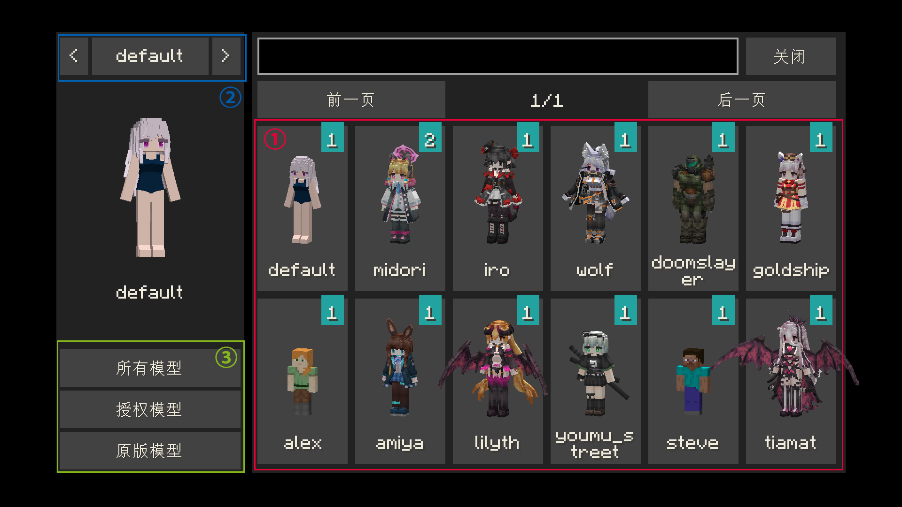

# Yes Steve Model 模组使用说明

## 一、简介

Yes Steve Model 模组是一个修改原版玩家模型的 `1.18.2 Minecraft Forge` 模组，它采用了 `geckolib` 作为核心，使用 Minecraft 基岩版模型和动画文件。从而使玩家能够随心所欲的自定义玩家模型和动画。


Yes Steve Model 模组考虑到了服务器群体的模组需求，采用了诸多适用于服务器环境的设计，包括但不限于：

- 自动同步客户端模型：普通玩家在进入服务器时，服务器会**自动**把模型同步到玩家的电脑上。
- 加密模型文件：发送到玩家客户端的模型全部是**加密的二进制文件**，有效避免模型窃取问题！
- 模型权限功能：模型可以单独设置授权，只有 OP 输入指令授权后，特定的模型才可以使用。
- 原版玩家模型修改：添加了默认的 Steve 和 Alex 模型，这两个模型均可自动调用玩家皮肤显示。
- 简单的自定义功能：模型自定义功能极其简单，只需要在特定文件夹放置模型、材质和动画文件，在游戏内输入重载指令即可自动加载、同步。**不需要书写任何配置文件**！

对于客户端玩家来说，使用也极其简单。当玩家首次进入服务器后等待十几秒（模型同步的耗时），即可使用快捷键 `Alt` + `Y` 打开如下 GUI 界面：



**① 模型切换按钮**：点击即可切换为对应的模型。如果按钮右上角图标为红色，说明该模型未授权。图标内数字代表该模型可切换的材质数量。

**② 材质切换按钮**：对于多个材质的模型来说，点击左右按钮可以切换模型材质。

**③ 模型类别切换按钮**：可以切换所有模型，已授权模型和原版模型（目前只有 Steve 和 Alex 模型）


## 二、如何制作自定义模型

Yes Steve Model 模组采用了 `geckolib` 作为核心，所有它支持 `geckolib` 兼容的`基岩版 1.12.0 `版本模型文件和`基岩版 1.8.0 `版本动画文件。

自定义模型文件全部放置在游戏主目录下的 `config\yes_steve_model` 文件夹下。`yes_steve_model` 下会自动生成三个文件夹：

- `auth ` 文件夹：用来放置自定义模型，该位置的自定义模型**必须授权**后才可以使用。

- `cache` 文件夹：系统自动从服务端获取的加密模型文件缓存文件夹。

- `custom` 文件夹：用来放置自定义模型，该位置的自定义模型**无需授权**就可使用。

你可以选择在 `auth` 或者 `custom` 文件夹下放置自定义模型文件，其文件结构如下：

```
custom （或 auth）文件夹
│
└─default                  模型包文件夹，游戏将会以此文件夹名作为模型 ID
    │ 
    ├─main.json            主模型文件（固定名称）
    ├─arm.json             手臂模型文件，用于第一人称手臂的显示（固定名称）
    ├─main.animation.json  主模型文件的动画文件（固定名称）
    ├─light_skin.png       主模型文件贴图1（名称可自定义，会作为游戏内显示名称）
    ├─...                  任意多个贴图文件
    └─dark_skin.png        主模型文件贴图2（名称可自定义，会作为游戏内显示名称）    
```

自定义模型、动画、材质文件均需放置在一个文件夹中。文件夹、材质名称等只能使用 `小写英文字符、数字、下划线` 等字符。

### 1.模型文件的制作

Yes Steve Model 模组主模型文件命名必须为 `main.json`。其使用的动画文件进行了标准化设计，只需要按照特定的布局方式来制作，即可自动兼容。

在运行游戏后，游戏主目录下的 `config\yes_steve_model\custom\default` 文件夹下会自动生成模型标准模型和动画文件，你可以在其基础上进行二次修改和分发。

::: warning
因为模型命名极其混乱，故统一对模型命名进行规范。

**当然，你可以不遵守这些标准，模型依旧可以安全加载。**
:::

####  ①.书写格式

组名应该全部采用大写驼峰式，并采用规范英文单词描述，按照 `形容词` + `名称` 形式进行组合，示例如下：

左手臂：`LeftArm`

整个头部：`AllHead`

####  ②.简洁原则

命名应该尽可能使用简洁易懂的英文单词，示例如下：

表示`整个`使用 `All` 而不是 `Whole`，因为前者更加简洁

表示`眼睛`使用 `Eyes` 而不是 `HeadEyes`，因为`眼睛`肯定处于 `Head` 分组中，无需强调

####  ③.无意义分组

部分模型中为了方便旋转，位移。对部分模型进行了分组，但并不附加动画和其他操作，可使用 `父类` + `数字编号` 的方式命名，示例如下：

某 `Mouth` 分组为了模型制作方便，设置了多个分组，但并没有特定的意义，也没有动画。可将其命名为 `Mouth1`， `Mouth2`， `Mouth3`等

####  ④.特定组名

某些特定组名不允许更改，否则会导致游戏部分内容无法正常显示：

|              组名              |                             说明                             |
| :----------------------------: | :----------------------------------------------------------: |
|             `Head`             |              游戏会默认添加头部随视角摆动的动画              |
|            `Eyelid`            |                    会在玩家眨眼时进行隐藏                    |
|  `LeftEyebrow` `RightEyebrow`  |                  会在玩家眨眼时向下移动一格                  |
|  `LeftHand` `LeftHandLocator`  | 左手手持物品的定位组<br/>`LeftHandLocator`必须位于`LeftHand`里面<br>由`LeftHandLocator`的旋转点定位手持物品 |
| `RightHand` `RightHandLocator` | 右手手持物品的定位组<br/>`RightHandLocator`必须位于`RightHand`里面<br/>由`RightHandLocator`的旋转点定位手持物品 |

### 2.第一人称视角手部模型的制作

第一人称视角的手部模型必须命名为 `arm.json`，可通过主模型二次修改获得该文件，它与主模型共用一套贴图。其制作方法可参考如下步骤：

1. 将主模型文件复制一份；
2. 找到 `LeftArm` 和 `RightArm` 分组，将其复制；
3. 删除整个 `Root` 分组；
4. 粘贴刚刚复制的  `LeftArm` 和 `RightArm` 分组；
5. 将 `LeftArm` 和 `RightArm` 分组的 `X` `Y` `Z` 旋转角度均修改为 0（内部分组不需要修改，修改后手臂应为垂直向下）。

### 3.贴图文件的制作

- 材质使用 `png` 格式材质，不建议使用**半透明**贴图，这会造成各种渲染错误；

- 材质文件名只能使用 `小写英文字符、数字、下划线` 等字符，其他没有限制；
- 模型支持多个贴图，你可以放置若干份贴图文件，游戏均会智能识别。

### 4.动画文件的制作

动画文件是可选选项。没有动画文件时，游戏会自动调用默认的动画文件。如果你的模型是按照默认模型二次修改的，那么即可完美兼容。

游戏内有如下动画是代码添加的，不可修改：

- 头部随鼠标摆动的动画：智能识别 `Head` 分组添加的动画
- 眨眼动画：智能识别`Eyelid` `LeftEyebrow` `RightEyebrow`分组添加的动画
- 睡着时的闭眼动画：智能识别`Eyelid` `LeftEyebrow` `RightEyebrow`分组添加的动画

如下动画是自定义动画，可通过进行二次修改：

|     名称      |            作用            |               备注               |
| :-----------: | :------------------------: | :------------------------------: |
|     walk      |   在玩家普通行走时的动画   |             循环播放             |
|      run      |     在玩家疾跑时的动画     |             循环播放             |
|   climbing    |    玩家在活板门下的动画    |             循环播放             |
|   sneaking    | 玩家潜行，但不移动时的动画 |             循环播放             |
|     sneak     | 玩家潜行，并且行走时的动画 |             循环播放             |
|     swim      |      玩家游泳时的动画      |             循环播放             |
|  swim_stand   | 玩家在水中站立式游泳的动画 |             循环播放             |
|   attacked    |     玩家被攻击时的动画     |             单次播放             |
|     jump      |    玩家离开地面时的动画    | 飞行和跳跃都调用此动画，循环播放 |
|      fly      | 玩家在鞘翅飞行时播放的动画 |             循环播放             |
|     boat      |    玩家坐在船上时的动画    |             循环播放             |
| use_righthand |  玩家使用右手时播放的动画  |             单次播放             |
| use_lefthand  |  玩家使用左手时播放的动画  |             单次播放             |
|     sleep     |      玩家睡觉时的动画      |             循环播放             |
|     ride      |   玩家骑马（驴）时的动画   |             循环播放             |
|   ride_pig    |      玩家骑猪时的动画      |             循环播放             |
|      sit      |      玩家坐下时的动画      |             循环播放             |
|    default    |     无任何操作时的动画     |             循环播放             |


## 三、相关指令

模组全部采用 `/ysm` 开头的指令，均需要 OP 4 等级权限才可以使用。所有的指令添加了游戏内的提示功能，所有模型 ID 、玩家 ID 即可智能提示。

- `/ysm model reload` 重载全部模型文件：同时还会将模型文件向所有客户端玩家全部同步一次；

- `/ysm auth <player> all` 向玩家授权全部模型；
- `/ysm auth <player> clear` 清除玩家所有授权模型；
- `/ysm auth <player> add <model_id>` 向玩家授权 xxx 模型；
- `/ysm auth <player> remove <model_id>` 清除玩家授权的 xxx 模型。